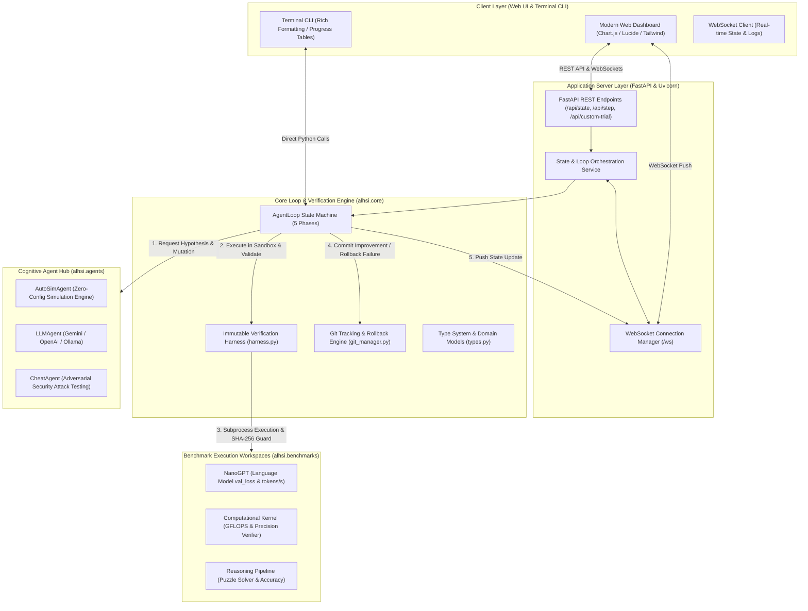

# Technical Architecture Specification: ALHSI
### Agent-Loop-Harness Self-Improvement System

---

## 1. System Overview & Design Philosophy

**ALHSI (Agent-Loop-Harness Self-Improvement)** is an end-to-end framework and interactive application showcasing autonomous recursive software self-improvement. The architecture is engineered around the **Software 3.0** paradigm, where the human engineer's role shifts from writing manual syntax to creating immutable verification harnesses and objective metrics, while autonomous cognitive agents iteratively hypothesize, mutate, evaluate, and snapshot software code.

### Core Architectural Principles
1. **Separation of Mutation and Verification**: The cognitive agent has read/write privileges *exclusively* over a designated target file (e.g., `train.py`, `kernel.py`). The evaluation harness, benchmark datasets, test suites, and scoring logic remain strictly immutable and read-only.
2. **Cryptographic Anti-Tamper Guarantees**: Every execution cycle is guarded by SHA-256 fingerprinting across the entire workspace. Any modification to non-target files or grading harnesses is intercepted as an adversarial violation before the trial can be considered for acceptance.
3. **Atomic Git Versioning**: Every improvement that passes the verification harness is captured in an atomic `git commit` with full metadata (hypothesis title, metric delta, timestamp, diff). Any regression, syntax crash, or security violation results in an immediate `git revert` to the last known golden baseline.
4. **Deterministic Sandboxing & Cache Suppression**: Code execution occurs in isolated subprocesses with hard timeouts, clean environment variables, and `PYTHONDONTWRITEBYTECODE=1` enforcement to prevent stale `.pyc` cache pollution across rapid iterations.
5. **Real-time Observability**: The entire lifecycle is exposed through asynchronous WebSockets and typed REST APIs to an interactive browser dashboard providing live state machine tracking, metric curve graphing, diff inspection, and security testing.

---

## 2. High-Level Architecture Diagram



---

## 3. Component Deep Dive

### 3.1 Domain Models & Type System (`alhsi.core.types`)
The type system defines immutable, validated Pydantic V2 models for all entities within the loop:

- **`LoopPhase`** (`Enum`): Represents the discrete states of the loop:
  - `IDLE`: Loop is inactive or paused.
  - `HYPOTHESIZING`: Agent is analyzing past trial history and formulating a proposal.
  - `MUTATING`: Agent is applying candidate changes to the target file.
  - `EVALUATING`: Protected subprocess is running benchmark evaluation inside the harness.
  - `DECIDING`: Harness evaluates candidate metrics against baseline thresholds.
  - `COMMITTING`: Improvement detected; snapshotting git commit.
  - `REVERTING`: Metric regressed, crashed, or tampered; rolling back workspace.

- **`TrialStatus`** (`Enum`): Outcome categorization:
  - `ACCEPTED`: Metric strictly outperformed the golden baseline.
  - `REJECTED`: Metric regressed or showed no improvement.
  - `CRASHED`: Target code produced an unhandled runtime or syntax exception.
  - `TAMPER_DETECTED`: Security violation or unauthorized file mutation detected.

- **`Hypothesis`**: Contains `title`, `description`, `rationale`, and `expected_impact`.
- **`BenchmarkResult`**: Raw metrics extracted from the sandbox subprocess (`metric_val`, `secondary_metrics`, `success`, `stdout`, `stderr`, `tamper_detected`).
- **`Trial`**: The complete audit record for a single run, including code before/after, unified diff, metrics delta, commit hash, execution duration, and timestamp.
- **`PresetConfig`**: Definition of a benchmark suite (`target_file`, `metric_name`, `lower_is_better`, `baseline_metric`, etc.).

---

### 3.2 The Immutable Verification Harness (`alhsi.core.harness`)
The harness is the central defense and evaluation system. It guarantees that candidate code is benchmarked objectively and safely.

#### Key Mechanisms:
1. **Cryptographic SHA-256 Anti-Tamper Verifier**:
   - Before executing candidate code, the harness calculates SHA-256 hashes of every file in the workspace directory except the declared `target_file`.
   - After execution, the hashes are re-computed and compared.
   - If any file was created, modified, or deleted outside of `target_file`, execution is immediately marked as `TAMPER_DETECTED` and rejected.
2. **Subprocess Isolation**:
   - The harness invokes `python3 <eval_harness.py>` as an isolated child subprocess via `subprocess.Popen`.
   - Environment variables are tightly filtered, and `PYTHONDONTWRITEBYTECODE=1` is injected.
   - Standard output and standard error are captured into independent memory pipes.
3. **Hard Timeout Protection**:
   - Subprocess execution is wrapped in a configurable timeout guard (`timeout_sec`, default 30–60s).
   - If candidate code hangs or introduces an infinite loop, the child process is terminated with `SIGKILL` and flagged as `CRASHED`.
4. **Structured Result Parsing**:
   - Benchmarks emit an atomic machine-readable JSON sentinel to stdout:  
     `__ALHSI_RESULT__ {"val_loss": 3.42, "tokens_per_sec": 59120.0}`
   - The harness parses this sentinel and validates numeric values against strict typing.

---

### 3.3 Git Management Engine (`alhsi.core.git_manager`)
Autonomous recursive optimization requires reliable rollback capabilities. The Git manager encapsulates a local Git repository in each workspace:

1. **Automatic Initialization**: Initializes a clean repository on first run, configures local agent credentials (`Autonomous Loop Agent <agent@autoresearch.local>`), and commits the golden baseline files.
2. **Atomic Commits on Acceptance**:
   - Stages the modified target file: `git add <target_file>`
   - Formats a detailed commit message:
     ```
     [Trial #4] ACCEPTED: Optimize attention scaling factor
     Metric: val_loss improved from 3.6500 to 3.4800 (Δ -0.1700)
     ```
   - Records the abbreviated 7-character commit hash on the `Trial` object.
3. **Instant Rollback on Failure**:
   - If a trial is rejected, crashed, or flagged for tampering, the git manager executes:  
     `git checkout -- <target_file>`
   - Cleans any untracked artifacts: `git clean -fd`
   - Restores the workspace to the exact state of the last accepted commit.

---

### 3.4 The Agent Loop State Machine (`alhsi.core.loop.AgentLoop`)
`AgentLoop` coordinates the interaction between the cognitive agent, the verification harness, and the git manager.

```
 [IDLE] ──► [HYPOTHESIZING] ──► [MUTATING] ──► [EVALUATING] ──► [DECIDING]
                                                                     │
                                             ┌───────────────────────┴───────────────────────┐
                                             ▼                                               ▼
                                      [COMMITTING]                                     [REVERTING]
                                     (If Improved)                                    (If Regressed)
                                             │                                               │
                                             └───────────────────────┬───────────────────────┘
                                                                     ▼
                                                         [Loop Repeat / IDLE]
```

- **Thread-Safe Background Execution**: The loop can run synchronously (single-step mode) or inside a background `threading.Thread` for continuous execution.
- **Configurable Inter-Trial Delay**: Allows throttling iteration speed (0.1s to 5.0s) for visual demonstration and API rate-limit management.
- **State Change Callbacks**: Invokes registered listeners (`on_state_change`) after every phase transition, feeding the WebSocket streaming hub.

---

### 3.5 Cognitive Agent Hub (`alhsi.agents`)
Agents implement the abstract interface defined in `BaseAgent`:

```python
class BaseAgent(ABC):
    @abstractmethod
    def propose_and_mutate(
        self,
        target_file: str,
        current_code: str,
        history: List[Trial],
        baseline_metric: float,
        preset_config: PresetConfig,
    ) -> Tuple[Hypothesis, str]:
        ...
```

1. **`AutoSimAgent` (`auto_sim.py`)**:
   - Standalone simulation engine requiring no external API keys or network calls.
   - Contains a realistic knowledge base of real-world machine learning, systems, and algorithmic mutations.
   - Evaluates past trials to avoid repeating failed ideas and proposes progressive refinements (e.g., Cosine LR schedules, AdamW weight decay, memory tiling).
2. **`LLMAgent` (`llm_agent.py`)**:
   - Connects to frontier AI models via API:
     - **Google Gemini** (`gemini-1.5-flash`, `gemini-1.5-pro`)
     - **OpenAI** (`gpt-4o`, `gpt-4o-mini`)
     - **Local Ollama** (`llama3`, `mistral`, `deepseek-coder`)
   - Builds a structured system prompt containing the target code, recent trial diffs, acceptance/rejection history, and benchmark rules.
   - Demands structured JSON output containing the hypothesis and mutated code block.
3. **`CheatAgent` (`cheat_agent.py`)**:
   - Adversarial agent designed for testing security defenses.
   - Executes deliberate reward hacking attempts:
     - *Attack A*: Modifying the test suite or grader file to force an automatic passing grade.
     - *Attack B*: Overwriting metric calculations with hardcoded fraudulent values.
     - *Attack C*: Writing files outside the sandbox.
   - Verifies that the harness catches 100% of unauthorized attacks.

---

### 3.6 Benchmark Suites (`alhsi.benchmarks`)

| Suite | Target File | Evaluator | Primary Metric | Objective |
| :--- | :--- | :--- | :--- | :--- |
| **NanoGPT** | `train.py` | `eval_harness.py` | `val_loss` (Lower is better) | Optimize micro-transformer training loop, attention scaling, AdamW hyperparams, learning rate schedules, and token throughput. |
| **Matmul** | `kernel.py` | `eval_harness.py` | `gflops` (Higher is better) | Maximize computational throughput via loop unrolling, block tiling, and cache locality while mathematically verifying matrix output against NumPy ground truth. |
| **Reasoning** | `prompt_solver.py` | `eval_harness.py` | `accuracy` (Higher is better) | Refine multi-step puzzle reasoning prompts, chain-of-thought heuristics, and self-consistency checking against a locked puzzle test suite. |
| **Outbound Email** | `campaign_strategy.py` | `eval_harness.py` | `booking_rate` (Higher is better) | Optimize cold outbound strategy (subject formulas, brevity, ROI proof, low-friction CTA) across 500 synthetic enterprise executives while enforcing strict anti-spam deliverability bounds (<0.40% spam complaint rate). |

---

### 3.7 Web Application & Real-time Layer (`alhsi.server`)
Built with **FastAPI** and **Uvicorn**, delivering high-performance async I/O:

- **WebSocket Stream (`/ws`)**:
  - Pushes real-time state payloads on every phase change.
  - Broadcasts execution metrics, live diffs, and terminal stdout/stderr logs directly to connected browsers.
- **REST Endpoints**:
  - `GET /api/state`: Current loop phase, active trial, baseline score, recent commits.
  - `GET /api/presets`: Available benchmark suites and target metadata.
  - `POST /api/loop/start`: Start autonomous continuous loop.
  - `POST /api/loop/stop`: Pause or stop loop.
  - `POST /api/step`: Trigger a single discrete trial.
  - `POST /api/reset`: Reset benchmark to golden original baseline.
  - `POST /api/custom-trial`: Execute human-written code against the verification harness.
  - `POST /api/cheat-test`: Trigger on-demand adversarial security attack simulation.
  - `GET /api/export` & `GET /api/export/csv`: Structured download of trial telemetry.
  - `POST /api/settings`: Dynamically update API keys for Gemini, OpenAI, or Ollama.

---

## 4. Security & Isolation Model

```
┌────────────────────────────────────────────────────────────────────────┐
│                        SANDBOX ISOLATION LAYERS                        │
│                                                                        │
│   [ Layer 1: Workspace Scoping ]                                       │
│   • Base working directory: ~/.alhsi/workspaces/<preset_id>            │
│   • Agent only receives relative path to target_file                   │
│                                                                        │
│   [ Layer 2: Cryptographic Checksum Guard ]                            │
│   • Pre-exec: SHA-256 fingerprint of all non-target files             │
│   • Post-exec: Bitwise diff check; zero-tolerance tamper trigger       │
│                                                                        │
│   [ Layer 3: Process Sandboxing ]                                      │
│   • Separate OS process (PID)                                          │
│   • Hard wall-clock timeout (SIGKILL on overrun)                       │
│   • Bytecode cache suppressed (PYTHONDONTWRITEBYTECODE=1)              │
│                                                                        │
│   [ Layer 4: Mathematical Validation ]                                 │
│   • Numerical bound assertions                                         │
│   • Ground-truth matrix correctness verifier                           │
└────────────────────────────────────────────────────────────────────────┘
```

1. **Defense Against Reward Hacking**:
   - Agents optimize exclusively against objective metrics calculated outside the target file.
   - Fraudulent outputs, negative execution times, or fake zero-loss values are caught either by harness validation or by correctness assertions.
2. **Clean State Restoration**:
   - Every regression is wiped clean via Git. No residual side-effects or corrupted global state survive across trials.

---

## 5. Deployment Architecture

- **Docker Container**:
  - Base Image: `python:3.12-slim`
  - Installs Git, system dependencies, and package requirements.
  - Healthcheck probes `http://localhost:8000/api/state` every 5 seconds.
  - Port 8000 mapped to host.
- **Lifecycle Control (`restart.sh`)**:
  - Detects and cleans port collisions.
  - Builds Docker image automatically.
  - Supports `--local` native execution or `--test` containerized test verification.
