# Step-by-Step Lifecycle Guide: What Happens When You Click a Button in ALHSI
### A Complete Under-the-Hood Walkthrough of the Autonomous Self-Improvement System

---

## 🧭 Executive Overview: The Journey of a Click

When you interact with the ALHSI dashboard, your actions initiate a synchronized pipeline spanning **six distinct architectural layers**:

```mermaid
sequenceDiagram
    autonumber
    actor User as 👤 User
    participant DOM as 🖥️ Browser DOM (index.html)
    participant JS as ⚡ Client Script (app.js)
    participant API as 🌐 FastAPI Server (app.py)
    participant Engine as 🔄 Loop Engine (loop.py)
    participant Agent as 🧠 Cognitive Agent (auto_sim / llm)
    participant Harness as 🛡️ Verification Harness (harness.py)
    participant Git as 📦 Git Engine (git_manager.py)
    participant WS as 📡 WebSocket Stream

    User->>DOM: Clicks "Auto-Run Loop" or "Step Once"
    DOM->>JS: Dispatches click event listener
    JS->>DOM: Optimistic UI update (status: STARTING, buttons toggle)
    JS->>API: HTTP POST /api/start or /api/step
    API->>Engine: start_continuous() or step()
    
    rect rgb(20, 30, 50)
        note over Engine,Harness: The 5-Phase Autonomous Research Cycle
        Engine->>Agent: Phase 1: propose_change(history, current_code)
        Agent-->>Engine: Hypothesis + Candidate Mutated Code
        Engine->>Engine: Phase 2: Overwrite target_file (e.g. train.py)
        Engine->>Git: Compute unified text diff (lines added/removed)
        Engine->>Harness: Phase 3: execute_eval(eval_script)
        Harness->>Harness: Compute SHA-256 pre-execution checksums
        Harness->>Harness: Spawn isolated subprocess (PYTHONDONTWRITEBYTECODE=1)
        Harness->>Harness: Verify post-execution hashes & parse __ALHSI_RESULT__
        Harness-->>Engine: BenchmarkResult (metric, secondary_metrics, logs)
        Engine->>Engine: Phase 4: Compare trial_metric vs golden baseline
        alt Metric Improved (Accepted)
            Engine->>Git: Phase 5a: git add & git commit -m "[Trial #N] ..."
            Engine->>Engine: Update baseline_metric & golden baseline_code
        else Metric Regressed / Crashed / Tampered (Rejected)
            Engine->>Git: Phase 5b: git checkout -- target_file & git clean -fd
        end
    end

    Engine->>API: _notify_state() triggered
    API->>WS: broadcast_state() via asyncio event loop
    WS->>JS: Push JSON payload: {"type": "state_update", "data": state}
    JS->>DOM: Redraw Chart.js curve, render Lab Notebook row, update diff viewer
```



---

## 🔴 Scenario 1: What Happens When You Click "Auto-Run Loop" (`#btn-start`)

Clicking the green **Auto-Run Loop** button launches the autonomous self-improving engine. Here is the step-by-step trace from physical click to code compilation and Git commit:

### Step 1: The Browser Captures the DOM Event
- In [`app.js`](file:///Users/donthireddy/code/github/agentic-ai-alhsi/alhsi/server/static/app.js#L525-L540), the click listener on `btnStart` fires immediately:
  ```javascript
  btnStart.addEventListener("click", async () => {
    const delay = parseFloat(selectDelay.value) || 1.0;
    btnStart.classList.add("hidden");
    btnPause.classList.remove("hidden");
    phaseStatusText.textContent = "Phase: STARTING...";
    ...
  });
  ```
- **Optimistic UI Reaction**: The browser hides the "Auto-Run" button, displays the "Pause" button, and lights up the status text to give you instant sub-millisecond visual feedback.

### Step 2: The HTTP Request is Dispatched
- The browser sends an asynchronous `POST` request to the backend:
  - **Endpoint**: `POST /api/start`
  - **Payload**: `{"max_trials": 30, "delay_sec": 1.0}`

### Step 3: FastAPI Activates the Autonomous Background Thread
- In [`app.py`](file:///Users/donthireddy/code/github/agentic-ai-alhsi/alhsi/server/app.py#L137-L145), the endpoint handler receives the payload:
  ```python
  @app.post("/api/start")
  def start_loop(payload: StartPayload):
      loop = get_or_create_loop()
      loop.start_continuous(max_trials=payload.max_trials, delay_sec=payload.delay_sec)
      ...
  ```
- In [`loop.py`](file:///Users/donthireddy/code/github/agentic-ai-alhsi/alhsi/core/loop.py#L258-L290), `start_continuous()` sets `self.running = True` and spawns a dedicated daemon thread `_worker()`.
- **Why a background thread?** This prevents the web server from blocking, allowing you to pause, inspect trials, or navigate the dashboard smoothly while experiments run.

### Step 4: The 5-Phase Autonomous Iteration Cycle Runs

Every trial executed by `_worker()` runs through five rigorous phases:

#### Phase 1: Hypothesize (`LoopPhase.HYPOTHESIZING`)
- The system calls `self.agent.propose_change()`:
  - **Inputs Provided to Agent**: The current golden code, past experiment history (which ideas worked and which failed), the target metric, and the trial counter.
  - **What the Agent Does**: Analyzes the codebase and formulates a scientific proposal (e.g., *"Adopt Cosine Annealing Learning Rate Schedule"*).
  - **Output**: Returns a typed `Hypothesis` object and the candidate modified code string.

#### Phase 2: Mutate Code (`LoopPhase.MODIFYING`)
- The loop writes the candidate code directly into the workspace target file (e.g., `train.py` or `kernel.py`).
- It calls [`git_manager.compute_text_diff()`](file:///Users/donthireddy/code/github/agentic-ai-alhsi/alhsi/core/git_manager.py) to generate a standard unified diff (`@@ -56,3 +56,3 @@`) showing the exact lines added or deleted.

#### Phase 3: Evaluate in the Sandbox Harness (`LoopPhase.EVALUATING`)
- The immutable verification harness in [`harness.py`](file:///Users/donthireddy/code/github/agentic-ai-alhsi/alhsi/core/harness.py) takes complete control:
  1. **Pre-Execution Checksum**: Calculates SHA-256 cryptographic hashes for every file in the project *except* the allowed target file.
  2. **Isolated Subprocess Execution**: Launches `python3 eval_harness.py` in an independent OS process with `PYTHONDONTWRITEBYTECODE=1` to prevent stale cache contamination.
  3. **Timeout Guard**: Wraps execution in a strict wall-clock timeout (e.g., 30s). If the code hangs, it is killed with `SIGKILL`.
  4. **Post-Execution Anti-Tamper Check**: Re-calculates SHA-256 hashes. If the test suite or evaluator was touched, the trial is flagged for tampering.
  5. **Sentinel Parsing**: Extracts the machine-readable output sentinel emitted by the sandbox:
     `__ALHSI_RESULT__ {"val_loss": 3.4200, "tokens_per_sec": 59120.0}`

#### Phase 4: Decision Rule (`LoopPhase.DECIDING`)
- The harness checks candidate performance against the **Golden Baseline**:
  - If `lower_is_better` (like loss): Is `trial_metric < baseline_metric`?
  - If `higher_is_better` (like GFLOPS or accuracy): Is `trial_metric > baseline_metric`?

#### Phase 5: Atomic Git Commit or Instant Revert
- **Branch A (Accepted Improvement - 🟢)**:
  1. Sets phase to `COMMITTING`.
  2. Calls `git_manager.commit_improvement()`: Runs `git add <target_file>` and creates a commit snapshot with a structured message.
  3. Updates the golden baseline metric and golden code string to this new standard.
- **Branch B (Regressed or Crashed - 🔴 / 🟡)**:
  1. Sets phase to `REVERTING`.
  2. Calls `git_manager.revert_changes()`: Executes `git checkout -- <target_file>` and `git clean -fd`.
  3. The workspace is restored to the pristine last-known-good state in milliseconds.

### Step 5: Real-time WebSocket Broadcast to the Browser
- On every phase change, `self._notify_state()` calls `broadcast_state(state)` in [`app.py`](file:///Users/donthireddy/code/github/agentic-ai-alhsi/alhsi/server/app.py#L54-L72).
- The server dispatches the payload across the thread boundary using `asyncio.run_coroutine_threadsafe()` to all active WebSocket clients.

### Step 6: Browser UI Re-Rendering
- In [`app.js`](file:///Users/donthireddy/code/github/agentic-ai-alhsi/alhsi/server/static/app.js#L465-L475), `ws.onmessage` receives the JSON packet:
  1. **Visual State Machine**: Highlights the active node (e.g., glowing green on "Sandbox Eval" or "Commit").
  2. **Chart.js Progression**: Appends the new metric point (colored green if accepted, red if rejected).
  3. **Lab Notebook**: Prepends a new audit row with hypothesis title, metric delta, and status badge.
  4. **Live Diff Viewer**: Updates the diff tab with color-coded additions (`+ green`) and deletions (`- red`).

---

## ⏭️ Scenario 2: What Happens When You Click "Step Once" (`#btn-step`)

Clicking **Step Once** executes one single, deterministic research cycle instead of looping continuously.

1. **User Action**: You click the blue **Step Once** button.
2. **Frontend UI Lock**: The button text changes to *"Running..."* and disables itself to prevent accidental double-clicks.
3. **HTTP Dispatch**: Sends `POST /api/step` to the backend.
4. **Synchronous Execution**: The backend invokes `loop.step()` synchronously:
   - Formulates one hypothesis.
   - Mutates the target file.
   - Runs the sandbox benchmark.
   - Decides and performs the Git commit or rollback.
5. **Payload Response**: Returns the complete `Trial` dictionary directly in the HTTP JSON response.
6. **Instant UI Refresh**: The client script calls `fetchState()`, immediately updates the chart, table, and diff viewer, and re-enables the button.

---

## 🛠️ Scenario 3: What Happens When You Click "Run My Code in Harness" (`#btn-run-manual`)

Located in the **Code Sandbox** tab, this button allows humans to test their own ideas against the immutable verification harness.

1. **User Action**: You edit the Python code in the browser textarea (e.g., tweaking `LR_SCHEDULE = "cosine"` or learning rate) and click **Run My Code in Harness**.
2. **Frontend Dispatch**: Dispatches `POST /api/custom-trial` containing your modified code and custom hypothesis note.
3. **Dynamic Human Agent Injection**:
   - In [`app.py`](file:///Users/donthireddy/code/github/agentic-ai-alhsi/alhsi/server/app.py#L190-L215), the server temporarily swaps the cognitive agent with a `HumanAgent` that presents your exact code as the candidate mutation.
4. **Sandbox Verification**:
   - The harness evaluates your code in the isolated subprocess.
   - If your modification lowers the loss / raises throughput without syntax errors, your code is **ACCEPTED** and permanently committed to Git!
   - If your modification causes a syntax error or regresses performance, the harness **REJECTS** it and safely restores the baseline.
5. **Modal Inspector**: The **Trial Detail Modal** automatically pops open on your screen, showing your exact diff, sandbox logs, and benchmark score.

---

## 🛡️ Scenario 4: What Happens When You Click "Launch Attack" in the Security Lab

Located in the **Security Lab** tab, these buttons demonstrate how the harness stops adversarial reward hacking.

1. **User Action**: You click **Launch Attack 1: Modify Eval Grader**.
2. **Frontend Dispatch**: Sends `POST /api/cheat-test` with `{"attack_type": "file_tamper"}`.
3. **Adversarial Agent Execution**:
   - The server assigns the [`CheatAgent`](file:///Users/donthireddy/code/github/agentic-ai-alhsi/alhsi/agents/cheat_agent.py).
   - The agent attempts to tamper with `eval_harness.py` to force an unconditional passing score.
4. **Harness Defense Interception**:
   - During post-execution verification, the harness detects that `eval_harness.py`'s SHA-256 hash does not match its pre-execution fingerprint.
   - The trial is immediately aborted with status `TAMPER_DETECTED` (🟣).
   - The git manager executes `git checkout` to restore the original grader file.
5. **Security Banner**: The dashboard displays a red-bordered alert:
   > **⚠️ ATTACK INTERCEPTED BY HARNESS**  
   > **Outcome:** TAMPER DETECTED  
   > **Reason:** Security Violation: Non-target file modification detected.

---

## ↺ Scenario 5: What Happens When You Click "Reset" (`#btn-reset`)

Clicking the **Reset** button restores the entire environment to its initial, pristine state.

1. **User Action**: You click **Reset** in the top navigation bar.
2. **Frontend Dispatch**: Sends `POST /api/reset` with the currently selected preset and agent.
3. **Loop Termination**: If a continuous background loop is running, the server immediately calls `loop.stop()` to cleanly terminate the worker thread.
4. **Filesystem Cleanse**:
   - Deletes all modified files in the workspace (preserving the `.git` directory).
   - Re-copies the original, unmodified benchmark files from the benchmark source directory.
5. **Baseline Measurement**: Runs a fresh evaluation of the clean code to establish the pristine baseline score.
6. **Git Initialization**: Creates a fresh Git commit: `Initial Baseline for <Benchmark>`.
7. **Audit Wipe**: Clears the trial list (`self.trials.clear()`).
8. **UI State Broadcast**: Broadcasts the zeroed-out state over WebSockets, resetting the Chart.js canvas and clearing the Lab Notebook.

---

## 📊 Summary Reference: Buttons, Endpoints & Side Effects

| Button | Element ID | Network Protocol | Backend Endpoint | Primary Architectural Side Effect |
| :--- | :--- | :--- | :--- | :--- |
| **Auto-Run Loop** | `#btn-start` | HTTP `POST` + WebSocket | `/api/start` | Spawns background worker thread; executes continuous 5-phase trials. |
| **Pause Loop** | `#btn-pause` | HTTP `POST` + WebSocket | `/api/pause` | Sets `self.paused = True`; freezes background thread between trials. |
| **Step Once** | `#btn-step` | HTTP `POST` + WebSocket | `/api/step` | Executes exactly 1 trial synchronously and returns the complete result. |
| **Reset** | `#btn-reset` | HTTP `POST` + WebSocket | `/api/reset` | Stops thread, re-copies pristine benchmark files, re-baselines, resets Git. |
| **Run My Code** | `#btn-run-manual` | HTTP `POST` | `/api/custom-trial` | Evaluates human code in sandbox; commits on improvement, reverts on failure. |
| **Launch Attack** | `.btn-launch-attack` | HTTP `POST` | `/api/cheat-test` | Simulates adversarial attack; proves SHA-256 tamper interception. |
| **Inspect / Details** | Row click / dot click | Client-side DOM | `openTrialModal()` | Opens inspector modal with full hypothesis, diff, logs, and commit SHA. |
| **Export CSV** | `#btn-export-csv` | HTTP `GET` (download) | `/api/export/csv` | Streams structured CSV of all trials, diffs, metrics, and timestamps. |
